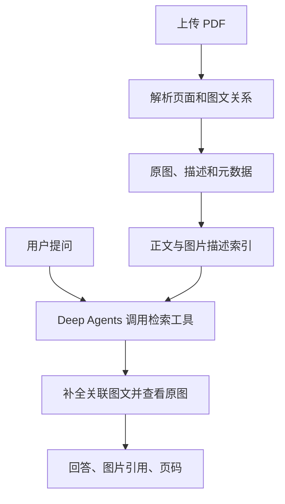

# 基于 Deep Agents 的图文 PDF RAG 智能体开发文档

> 版本：1.0 · 日期：2026-09-23 · 实施范围：上传图文交错的 PDF，按知识点问答，并在回答中返回相关完整图片及出处。

## 1. 目标和验收范围

用户上传论文、教材或手册等 PDF。文件可能同时包含正文、图注、照片、结构示意图、矢量绘图、表格和扫描页面，文字与图片交叉排布。上传处理完成后，用户针对该 PDF 提问，系统应：

1. 根据文件内容回答，提供文档名、页码和可核查的引用。
2. 如果相关知识点有配图，返回完整、清晰的原图，以及图注和来源页；不能仅返回图片的文字描述。
3. 当答案涉及图内箭头、标注、颜色或空间关系时，让多模态模型检查实际图片后再作答。
4. 当检索不到可靠依据时明确说明，不编造图片或出处。
5. 同一文件重复上传或同一图片重复出现时去重，同时保留所有出现位置和关联正文。

本文的“返回图片”指服务端返回可访问的图片资源和引用信息，由客户端显示；模型输出文字不能代替这个步骤。

## 2. 技术分工

| 部件 | 建议职责 |
| --- | --- |
| Deep Agents | 问答智能体；调用知识库检索和图片查看工具；整合证据并生成文字回答。使用 `create_deep_agent` 创建。 |
| LangChain 组件 | 按需使用加载器、分块器、嵌入模型、向量库接口；Deep Agents 已基于 LangChain，无须再创建一套独立智能体。 |
| LangGraph 运行时 | Deep Agents 底层使用，提供运行和状态能力；第一版不必另写 LangGraph 图。 |
| PDF 版面解析器 | 在上传任务中解析段落、图注、页面和图片区域。可选 Docling 作为第一版方案，并用真实样本验证。 |
| 多模态模型 | 在入库时描述图片；回答图形细节问题时查看命中的原图。选择支持工具调用和图片输入的具体模型及接口。 |
| 对象存储 | 保存原始 PDF、完整裁图和可选的页面预览。 |
| 元数据数据库 | 保存文档、段落、图片、图注、位置和图文关系。 |
| 向量数据库及可选关键词索引 | 检索正文分块与图片描述。 |
| 前端与业务后端 | 接收上传、展示处理状态、提供带鉴权的图片地址、渲染回答和原图。 |

**关键架构决定：**把上传建库设计成确定性的后台任务；把知识库检索和看图封装为 Deep Agents 的工具。仅将 PDF 放进智能体的临时文件系统，不会自动创建可长期使用的图文索引。



## 3. 上传与建库流程

### 3.1 接收和任务状态

1. `POST /documents` 接收 PDF，验证文件类型、大小和用户权限，返回 `document_id` 与状态 `queued`。
2. 存储原始 PDF，计算内容哈希。相同租户、相同内容和相同处理版本的上传可复用已有解析结果；仍要保留用户自己的文档记录和访问权限。
3. 异步任务更新状态：`queued → parsing → describing → indexing → ready`；失败时为 `failed` 并记录可重试错误。
4. 所有页面、段落和图片记录都带 `tenant_id`、`document_id` 和 `ingestion_version`；索引写入应支持重复执行且结果一致。

### 3.2 解析交错排版

逐页获取标题、段落、图注、表格、图片区域、阅读顺序和页面坐标。保留版面解析器给出的元素 ID 与来源位置，供后续复核。

对每个图形区域保存**完整图**：

- 纯位图且边界正确时，可直接提取原始图像；仍需核对图注和标注是否在图像外。
- 矢量图、混合图、多个对象拼接的图，或图注附近的独立标签，应渲染页面并按图形边界裁剪。把需要完整展示的所有子图纳入同一张总图。
- 不能确定边界时，保存整页图作为回退，并给图片标记 `needs_review`；不要悄悄用缺失一半的裁图替代。
- 扫描版 PDF 以整页图像为输入，结合版面解析、OCR 或视觉模型提取文字与图形区域。模型能识图不代表能稳定输出论文级别的精确阅读顺序，须用样本检查。

首版可用 Docling 解析 PDF；其官方示例支持生成页面图及图形/表格图。对跨页图、复杂子图、浮动图、矢量标注与错误裁剪，需要额外校验和回退策略。[Docling 图形导出示例](https://docling-project.github.io/docling/_generated/examples/export_figures/)

### 3.3 建立图文关联

先用显式证据建立关联，再用位置推断：

1. 匹配图片编号与图注，例如“图 3”“Fig. 3”；图注与图片建立 `caption_of` 关系。
2. 识别正文中的“见图 3”“as shown in Fig. 3”，把相应段落与图片建立 `references` 关系。
3. 在没有显式编号时，根据同章节、阅读顺序、页面位置和图注距离生成候选 `nearby` 关系，并降低置信度。
4. 一张图可关联多个段落，段落也可引用多张图；跨页引用必须支持。
5. 对低置信度关联不要自动把图片展示为确定证据；可在最终回答中仅展示有可靠依据的图片。

### 3.4 给图片生成检索描述

将完整裁图、图注、所属章节标题及少量相关正文发送给多模态模型，得到结构化内容：

```json
{
  "visible_summary": "图中实际可见的结构或过程",
  "visible_labels": ["图内标签 A", "图内标签 B"],
  "caption": "原文图注",
  "context_summary": "正文如何解释这张图",
  "uncertain_details": ["看不清的细节"]
}
```

`visible_summary` 必须依据图像；`context_summary` 标明来自正文。看不清的数字、箭头、坐标轴和符号不得猜测。存储原图、原始图注、描述、模型与提示词版本，支持将来重新生成描述。

### 3.5 分块、索引和去重

- **正文索引：**按章节与语义分块。每个块保留章节、页码范围、段落 ID、显式引用的图片 ID，以及邻近图片候选 ID。
- **图片索引：**把图注、可见标签、图像描述及相关正文的精简摘要组成检索文本；每张图单独生成一条或多条索引记录，指向 `image_id`。
- **检索方式：**首版采用文本向量检索 + 关键词检索。关键词用于准确命中“图 3”、专有术语和公式名称。后续如需按纯视觉特征找图，可增加图像向量索引；不是首版必需项。
- **文件去重：**原始文件哈希检测重复上传；图片内容哈希识别完全相同的图片资产。同一张图片在不同页面出现时，存储可复用，但每一次出现的图注、文档、页码和关联段落必须分别保留。
- **索引去重：**以 `tenant_id + document_id + ingestion_version + item_type + source_id` 定义稳定键，重复任务执行时更新或跳过，而不是生成重复向量。

向量库存储供检索使用的内容和 ID；**不要指望从向量恢复原图**。LangChain 的文档加载器、嵌入和向量库可作为这些环节的组件。[LangChain 文档加载器](https://docs.langchain.com/oss/python/integrations/document_loaders) · [Deep Agents 的检索说明](https://docs.langchain.com/oss/python/deepagents/retrieval)

## 4. 数据结构建议

以下是业务数据模型示意，字段名可随实际数据库调整。

```text
Document
  id, tenant_id, owner_id, filename, pdf_object_key, sha256,
  status, ingestion_version, page_count, created_at

TextChunk
  id, document_id, section, text, page_start, page_end,
  paragraph_ids[], referenced_image_ids[], nearby_image_ids[]

ImageAsset
  id, tenant_id, sha256, original_object_key, preview_object_key,
  width, height, mime_type

ImageOccurrence
  id, document_id, image_asset_id, page_number, bbox,
  figure_number, caption, description, visible_labels[],
  extraction_method, needs_review

ChunkImageLink
  chunk_id, image_occurrence_id, relation, confidence
  # relation: references | caption_of | nearby | explains

IndexItem
  id, document_id, source_type, source_id, embedding_version,
  searchable_text, index_status
```

**图片资产与图片出现位置分离：**同一文件内容可有一个 `ImageAsset`、多个 `ImageOccurrence`。用户引用的是出现位置，便于显示正确的页码、图注及正文背景。`bbox` 使用统一的坐标系，并记录是 PDF 坐标还是像素坐标。

## 5. 提问与回答流程

### 5.1 检索和补全证据

用户提问“论文中注意力机制如何工作？请把相关图也给我看”时：

1. 后端根据当前用户权限确定可检索的 `document_id`。不能由模型指定任意租户或绕过权限过滤。
2. Deep Agents 调用 `search_knowledge(query, document_id)`。检索正文块、图片描述和关键词，融合并重排结果。
3. 如果命中正文，沿 `ChunkImageLink` 补全显式关联图片；如果命中图片，补全图注及解释它的正文。邻近关系仅作为候选。
4. 检索工具返回有限数量的证据：`chunk_id`、`image_occurrence_id`、页码、图注、相关文字、关系类型、分数及权限内的图片引用标识。
5. 遇到关于图内细节的问题，Agent 调用 `inspect_image(image_occurrence_id)`，工具向支持图片的模型返回实际图像内容。不要仅把 URL 当成已经看过的图片。
6. Agent 根据可核查的证据生成答案，引用已返回的图片和页码。若没有足够证据，说明不确定。
7. 后端校验 Agent 引用的每个 ID 是否由本次工具结果提供、属于当前文档且用户有权访问，再生成短时有效的图片 URL；客户端负责展示完整图及“查看 PDF 第 N 页”。

对于图片输出，推荐在回答前由后端根据**已验证的检索结果**选择图片候选并去重，模型负责判断其解释是否相关；最终图片列表由后端验证组装。这样图片地址、页码和资源 ID 不依赖模型自由生成。

### 5.2 Deep Agents 接入示意

下面代码展示接口边界，其中 `knowledge_service` 是**需要自行实现的业务服务**，不是 Deep Agents 的内置对象；模型名与供应商按部署环境配置。工具返回精简证据，实际的图片读取工具须按模型提供商的多模态内容块格式实现。

```python
from deepagents import create_deep_agent


def search_knowledge(query: str, document_id: str) -> dict:
    """检索用户当前有权访问的文档，返回正文及图片候选的 ID 与出处。"""
    return knowledge_service.search(
        query=query,
        document_id=document_id,
        # tenant_id / user_id 应来自可信的请求上下文，而非模型参数。
    )


def inspect_image(image_occurrence_id: str) -> list[dict]:
    """读取命中的完整原图，供支持图片输入的模型核对图内细节。"""
    return knowledge_service.image_content_blocks(image_occurrence_id)
    # 返回符合所选模型和 LangChain 适配器要求的 text/image 内容块。


agent = create_deep_agent(
    model=MODEL_WITH_TOOL_CALLING_AND_IMAGE_INPUT,
    tools=[search_knowledge, inspect_image],
    system_prompt=(
        "回答当前用户的问题时，先检索指定文档。"
        "当问题涉及图中的标签、箭头、数值或空间关系时查看原图。"
        "只引用工具返回的来源 ID，不编造页码或图片。"
        "如果证据不足，明确说明。"
    ),
)
```

**实现提示：**此示意省略了请求级授权注入、服务实例初始化、模型配置、输出结构化校验和错误处理；这些属于业务后端。`inspect_image` 的多模态返回方式须按具体模型适配器验证。Deep Agents 支持图片输入及多模态工具结果，但依赖底层模型能力。[Deep Agents 快速开始](https://docs.langchain.com/oss/python/deepagents/quickstart) · [多模态工具结果说明](https://docs.langchain.com/oss/python/deepagents/multimodal)

### 5.3 面向前端的响应

服务端响应示例；图片地址由服务端在鉴权后生成，示例路径并非框架固定协议：

```json
{
  "answer": "根据第 3 节正文，注意力机制先计算 Query 与 Key 的相关性，再对 Value 加权汇总。图 2 展示了该过程。",
  "citations": [
    {"document_id": "doc_01", "chunk_id": "chunk_18", "page": 4}
  ],
  "images": [
    {
      "image_occurrence_id": "img_occ_02",
      "figure_number": "图 2",
      "caption": "注意力机制结构图",
      "page": 4,
      "image_url": "/api/documents/doc_01/images/img_occ_02",
      "source_page_url": "/api/documents/doc_01/pages/4"
    }
  ]
}
```

前端按 `images` 渲染完整图片或可点开原图的预览；保持图像比例，不将裁图缩到无法阅读；同时展示图注、页码和来源 PDF 入口。接口获取图片时再次检查用户权限，不允许靠猜测 `image_occurrence_id` 获取其他文档图片。

## 6. 错误处理与质量门槛

| 情形 | 处理方法 |
| --- | --- |
| 图形区域裁剪不完整 | 使用整页预览回退，并标记待校验；不把残缺图声称为完整原图。 |
| 图注误配、正文跨页引用 | 以图号和引用为主要证据；低置信度关系进入人工抽检。 |
| 图片描述漏掉关键内容 | 检索命中后让模型看原图；可对高价值文档生成更细的标签、子图描述。 |
| 扫描页面识别质量差 | 提高渲染质量、调整识别流程，保留原页面供最终核验。 |
| 用户只问文字知识点 | 返回相关性足够高的图；不强制附上所在页面的所有图片。 |
| 模型引用了不存在的图片 ID | 后端丢弃无效引用并记录错误，必要时重新生成答案。 |
| 同图在不同位置出现 | 图像资产可复用，但按当前命中上下文选择正确的 `ImageOccurrence` 和出处。 |
| 图片或文件被删除 | 同步删除或失效化元数据、索引、图片访问地址；避免返回悬空引用。 |

**验收测试集：**准备至少一份图文交错论文，覆盖正文引用远处图、跨页图注、多子图、嵌入位图、矢量结构图、扫描页、重复图片和无关图片；为每类准备真实问题。检查：回答事实正确、图号与页码正确、返回图片完整、无关图片不出现、图片接口权限正确、重复导入无重复记录。对图片细节问题，应检查模型的结论是否真的来自原图，而非仅来自自动描述。

## 7. 第一版实施顺序

1. 完成 PDF 上传、后台处理状态、原文件存储与鉴权。
2. 接入版面解析，保存段落、图注、完整图与页面来源；先用少量代表性论文人工检查裁剪和图文关联。
3. 为图生成描述，建立正文索引与图片描述索引；保留所有 ID 和关系。
4. 实现 `search_knowledge`、`inspect_image`，接入 `create_deep_agent`。
5. 实现后端图片引用校验、图片接口与前端展示。
6. 用上述测试集验收，针对错误裁图、误配图和检索遗漏迭代；再考虑图像向量检索、复杂重排与更细的子图识别。

## 8. 官方资料

- [Deep Agents 概览](https://docs.langchain.com/oss/python/deepagents/overview)：与 LangChain、LangGraph 的关系。
- [Deep Agents 检索](https://docs.langchain.com/oss/python/deepagents/retrieval)：连接知识库、检索工具与 RAG。
- [Deep Agents 多模态](https://docs.langchain.com/oss/python/deepagents/multimodal)：图片输入、工具结果和上下文管理。
- [Docling 导出图形](https://docling-project.github.io/docling/_generated/examples/export_figures/)：生成页面图与图形/表格图片。

> 上述框架与解析器的具体参数会随版本变化。实际开工时锁定依赖版本，并用目标模型和真实 PDF 样本做一次端到端验证。
