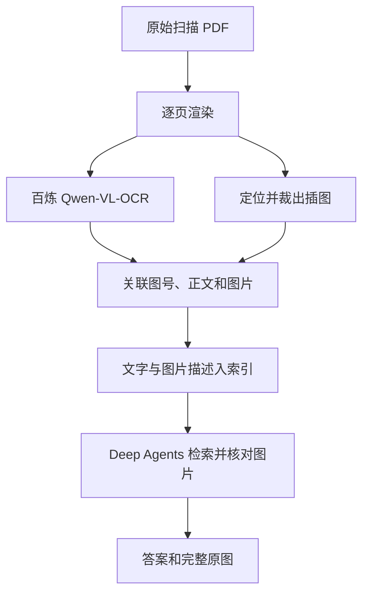

# 基于百炼 Qwen-VL-OCR 与 Deep Agents 的扫描 PDF 图文 RAG 开发文档

> 版本：1.0｜日期：2026-09-23｜目标文件示例：《微电子制造科学(1)》扫描版 PDF（630 页）。

## 1. 目标

用户上传原始扫描 PDF。后台识别文字、公式和图注，保存原始页面以及独立插图，建立正文与插图的关联。用户询问知识点时，Deep Agents 检索相关内容，必要时查看实际图片，返回有出处的文字答案和可展示的完整图片。

本方案使用阿里云百炼的 **Qwen-VL-OCR** 系列作为远程 OCR 服务。第一版选 `qwen-vl-ocr` 稳定别名；如果样本页的定位能力或输出长度不满足要求，可测试 `qwen-vl-ocr-latest` 或锁定具体版本。选择模型名是配置项，版本变化须重新验收。[百炼 Qwen-OCR 模型说明](https://help.aliyun.com/en/model-studio/qwen-vl-ocr)

### 必须先厘清的能力边界

- 官方文档列出了 Qwen-VL-OCR 对**图片**的文档解析、文本定位等任务。直接以 PDF 文件作为输入的 Response API 文档当前针对的是 `qwen3.5-ocr`；本方案使用指定的 `qwen-vl-ocr`，所以**先把 PDF 逐页渲染为图片，再提交页面图**。[百炼 PDF 文档解析说明](https://help.aliyun.com/en/model-studio/qwen-vl-ocr)
- `document_parsing` 任务主要输出文档转录内容（LaTeX 文本），`advanced_recognition` 可输出文字行坐标；**不能把 OCR 文字坐标误当作完整插图边界**。独立插图的定位、裁图和验证由后端额外完成。[百炼 OCR 任务说明](https://help.aliyun.com/en/model-studio/qwen-vl-ocr-api-reference)
- 上传一份 630 页文件不是一次模型调用。后台按页执行、保存进度、限制并发并统计实际用量。百炼 API 调用存在计费，部署前按所选地域和模型查询当前价格。[模型信息与计费](https://help.aliyun.com/en/model-studio/qwenvl-ocr)

## 2. 系统架构与分工

| 模块 | 职责 |
| --- | --- |
| 上传接口 | 接收 PDF、校验类型和用户权限、创建文档与后台任务。 |
| 页面渲染器 | 把每页 PDF 转为 PNG/JPEG；记录 PDF 页码、页图尺寸与原文件。可使用 PyMuPDF 或 Poppler。 |
| 百炼 Qwen-VL-OCR 适配器 | 对页面图进行文档解析；必要时对图注附近或可疑页面做高精度文本定位。 |
| 版面与裁图模块 | 根据页面图、OCR 内容和坐标推断插图边界，生成独立完整裁图；低置信度时保留整页图作为回退。 |
| 图文关联模块 | 从图号、图注、正文引用和章节关系建立 `chunk_id ↔ image_id`；允许跨页与一对多。 |
| 索引模块 | 将正文块、图注和图片描述向量化，并建立关键词索引；保存原图资产引用。 |
| Deep Agents 智能体 | 调用检索和原图查看工具，整合证据，给出答案和图的来源 ID。 |
| 回答 API 与前端 | 校验来源 ID，生成有权限约束的图片链接，显示完整图片、图注与页码。 |



## 3. 环境与百炼配置

1. 在百炼创建 API Key，选择服务地域，并获取该地域对应的工作空间接口地址。**API Key 与接口地域必须匹配**；密钥只放在服务端环境变量中。
2. 在负责上传后处理的 Python 环境中安装 `dashscope`、`pymupdf` 和图片处理依赖；DashScope SDK 版本满足官方当前最低要求。模型服务运行在百炼侧，项目服务端仅运行文件处理和 API 客户端。[百炼接入示例](https://help.aliyun.com/en/model-studio/qwen-vl-ocr)

```bash
python -m pip install dashscope pymupdf pillow
```
3. 服务端配置示例：

```text
DASHSCOPE_API_KEY=（仅配置在服务端）
BAILIAN_BASE_HTTP_API_URL=https://{WorkspaceId}.cn-beijing.maas.aliyuncs.com/api/v1
QWEN_OCR_MODEL=qwen-vl-ocr
```

上面北京地址是**格式示例**，并非可以原样运行的公共接口。实际地域和 `WorkspaceId` 以账户中的官方配置为准。生产环境启用调用次数、并发量、费用监控和失败重试；不要将密钥、私人 PDF、完整 Base64 图片或含敏感内容的原始模型响应写进公开日志。

## 4. 上传建库流程

### 4.1 文件接收与状态

`POST /documents` 保存原始文件，返回 `document_id` 和状态 `queued`，异步启动任务。每页记录 `page_index`（从 1 开始的 PDF 页码）、处理状态、处理版本、错误原因和重试次数。处理状态建议为：`queued → rendering → ocr → figures → indexing → ready`，失败为 `failed` 或 `partial_ready`。

以租户、文件哈希和处理版本进行幂等判断；重复上传不应重复创建向量。保存完整原始 PDF 与页面图。书上的印刷页码与 PDF 页码分别保存，不要混用。

### 4.2 渲染页面图

上传的是扫描 PDF，Qwen-VL-OCR 调用需要页面图。对原书逐页渲染，并固定一个坐标系，供 OCR 文字定位、裁图和图片来源跳转使用。

```python
import pymupdf

with pymupdf.open(pdf_path) as pdf:
    page = pdf[19]  # PDF 第 20 页；库内索引从 0 开始
    png_bytes = page.get_pixmap(dpi=150, alpha=False).tobytes("png")
```

这本样本书的扫描底图约 132 DPI；提高 PDF 渲染 DPI 会扩大输出像素，不能恢复原扫描已丢失的细节。尽量保留原页面及生成图片尺寸。如果后续缩放页面图，必须同步换算所有坐标。[PyMuPDF 页面渲染文档](https://pymupdf.readthedocs.io/en/latest/recipes-images.html)

### 4.3 调用 Qwen-VL-OCR

第一轮对**每页**运行 `document_parsing`，保存原始转录、页码、模型版本与调用状态。对图号含糊、图注难匹配的页面，再运行 `advanced_recognition` 获取文字行的坐标。后者用于定位文字，图片边界仍需后端判定。

下面是**单页最小调用示意**。该代码不包含数据库、裁图、费用控制和重试；模型与地域由环境变量配置，响应结构按当前 DashScope SDK 的官方示例读取。直接传 Base64 页面图，不需要将私人页面公开成 URL。[DashScope 文档解析与本地图片传入方式](https://help.aliyun.com/en/model-studio/qwen-vl-ocr)

```python
import base64
import os
import dashscope

dashscope.base_http_api_url = os.environ["BAILIAN_BASE_HTTP_API_URL"]


def parse_scanned_page(png_bytes: bytes, task: str = "document_parsing") -> str:
    image_data = base64.b64encode(png_bytes).decode("ascii")
    response = dashscope.MultiModalConversation.call(
        api_key=os.environ["DASHSCOPE_API_KEY"],
        model=os.getenv("QWEN_OCR_MODEL", "qwen-vl-ocr"),
        messages=[{
            "role": "user",
            "content": [{"image": f"data:image/png;base64,{image_data}"}],
        }],
        ocr_options={"task": task},
    )
    if response.status_code != 200:
        raise RuntimeError(f"OCR API failed: {response.status_code}")
    content = response["output"]["choices"][0]["message"].content
    return content[0]["text"]
```

**实现要求：**优先保留百炼返回的原始结果与请求 ID，用适配器验证输出字段和解析状态；`document_parsing` 输出可能含 LaTeX，`advanced_recognition` 输出可能含坐标结构。对空响应、格式错误、输出截断和限流建立重试或分区域处理，不要把截断文本当作完整页面入库。官方说明 `qwen-vl-ocr` 的默认输出长度有限，密集页需专门验收。[百炼输出限制](https://help.aliyun.com/en/model-studio/qwen-vl-ocr-api-reference)

### 4.4 定位完整插图

**关键限制：Qwen-VL-OCR 的文档转录结果不是“每张插图的可靠裁切坐标”。** 第一版定义一个独立的 `figure_locator(page_image, ocr_result)` 模块，可先使用 OCR 文本框、图注位置、留白、图形连通区域等规则生成候选插图边界。对候选裁图进行检查：图形主体、坐标轴、子图、图内标签是否完整；多个图不能错误合并。

可用多模态模型辅助给出候选位置或描述，但模型输出的坐标必须映射回页面图并核验，不能直接当作确定的像素边界。对失败页面保存**整页原图**作为回退，并标记 `image_kind=page_fallback`；前端明确显示“来源页图”，避免把整页误称为独立插图。

裁图和描述分别存储：

```text
image_id, tenant_id, document_id, pdf_page, printed_page,
page_image_key, crop_image_key, bbox_px, crop_status,
figure_number, caption, visual_description, processing_version
```

`bbox_px` 以原页面图的左上角为原点，保存原图宽高。对于图内细节不清或小字无法识别的扫描页，不让模型补猜数值；保留页图供用户放大核对。

### 4.5 匹配图号、图注与正文

1. 正则及文本清洗识别“图 1.1”“图1-1”“Fig. 1.1”等编号；保留 OCR 原文与标准化编号。
2. 使用图注坐标及图形候选位置匹配；若同页存在多图，编号和版面关系应共同成立。正文中的“如图 1.1 所示”应关联编号相同的图，允许图在另一页。
3. 记录关系类型与置信度：`explicit_reference`、`caption_match`、`nearby_candidate`。只凭距离得到的候选不自动作为可靠证据展示。
4. 段落可链接多张图，图片也可关联多个解释段落。对无法解析的图保留整页回退，并记录人工核查状态。

### 4.6 图片描述、向量化与去重

可将**已裁出的图**连同图注及附近正文交给支持图像输入的多模态模型生成检索描述；使用 Qwen-VL-OCR 做图中文字识别时，将视觉描述和 OCR 转录分开保存，不能将“模型推断”当作图注原文。

- 建立正文块索引：`chunk_id`、正文、章节、PDF 页码、引用的 `image_id`。
- 建立图片索引：`image_id`、图号、图注、视觉描述、图内标签与来源页码。
- 对图号、公式编号和专业术语保留关键词检索，再与向量检索合并。
- 文件内容哈希和图片哈希用于去重；即使图片资产复用，其每次出现的页码、图注与正文关系仍独立保存。
- 向量库存储检索记录和图片 ID，**完整原图放对象存储**，不能从向量恢复图片。

## 5. Deep Agents 问答流程

1. 用户选择文档并提问。后端先按用户身份限制可检索文档集合。
2. Deep Agents 调用 `search_knowledge(query, document_id)`，检索正文块与图片描述；工具返回正文、图注、页码、关系类型和图片 ID。
3. 命中正文时沿 `chunk_id → image_id` 找图；命中图片时补全图注和解释它的正文。按相关性排除同页无关图。
4. 问题涉及曲线、数值、标注或位置时，Deep Agents 调用 `inspect_image(image_id)` 查看**实际裁图或页面回退图**。这个查看能力需要其使用的问答模型支持图片输入；Qwen-VL-OCR 的建库调用不会自动把图片送给问答模型。
5. 智能体生成带来源的答案。后端只接受本轮检索已返回且权限校验通过的 `image_id`，组装图片访问地址。前端显示图片、图注、PDF 页码和“打开来源页”。

```json
{
  "answer": "根据第 20 页的正文和图 1.1，这里讨论的是……",
  "citations": [{"document_id": "doc_01", "pdf_page": 20, "chunk_id": "chunk_20_3"}],
  "images": [{
    "image_id": "img_20_1",
    "figure_number": "图 1.1",
    "pdf_page": 20,
    "kind": "figure",
    "url": "/api/documents/doc_01/images/img_20_1",
    "source_page_url": "/api/documents/doc_01/pages/20"
  }]
}
```

上面是应用自己的 API 格式，并非百炼或 Deep Agents 的内置响应。图片 API 每次读取均校验权限。Deep Agents 自定义检索工具可连接已有知识库；文件建库属于后台任务，不要求让智能体逐页决定 OCR 流程。[Deep Agents 检索说明](https://docs.langchain.com/oss/python/deepagents/retrieval) · [多模态工具结果](https://docs.langchain.com/oss/python/deepagents/multimodal)

## 6. 630 页文件的批处理与费用控制

1. 先按 PDF 页码处理第 20、39、100、300、600 页，审查页图、转录、图号、独立裁图和答图是否正确。
2. 验收通过后以小批量任务覆盖全书；每页独立记录状态、耗时和 token 用量，失败页可单独重试。
3. 限制并发，遇到限流按服务响应进行退避重试；避免同时发送大量 Base64 页面图占满内存。
4. 只在图注无法定位或图中文字关键时增加高精度识别调用；对长文输出截断的页面按区域重试，并保留页码和坐标偏移。
5. 对同文件同处理版本复用缓存；模型版本或提示词变更时显式重新索引。上线前以样本页实际 token 用量估算整本书成本，不写死价格。

## 7. 验收用例

| 提问 | 期待结果 |
| --- | --- |
| “第 20 页图 1.1 说明什么？请返回原图。” | 有依据的解释；返回第 20 页对应完整图，或明确标识为整页回退图。 |
| “第 20 页两张不同的图分别展示什么？” | 区分图号，不重复返回同一张裁图。 |
| “请解释第 100 页的两张曲线图。” | 两图分别被正确检索；不捏造看不清的坐标数值。 |
| “书里某段话提到图 1.1，图在哪里？” | 命中正文后沿关联找到图片，页码正确。 |
| “这本书是否讲过某个并未出现的知识点？” | 明确未找到依据，不附无关图片。 |

检查指标至少包含：文字内容可读、图号和正文关联正确、图片裁剪完整、实际图片 URL 可打开、图片来自当前用户有权限的文档，以及重复上传无重复索引。

## 8. 实施顺序

1. 接入百炼地域配置和 API Key，在独立处理服务跑通**一页图**的 `document_parsing`。
2. 保存 OCR 原始结果与页面图；建立页面处理状态和失败重试。
3. 实现图号识别、图形区域候选、独立裁图与整页回退；人工验收代表性页。
4. 生成图片描述并复用现有文字索引、图片资产和图文关联数据库。
5. 接通 Deep Agents 的 `search_knowledge` / `inspect_image`，完成后端图片 ID 权限校验和前端展示。
6. 用样本问题验收后分批处理 630 页，并依据真实质量和费用调整模型版本与处理策略。

## 9. 官方参考

- [阿里云百炼 Qwen-OCR 使用说明](https://help.aliyun.com/en/model-studio/qwen-vl-ocr)
- [Qwen-OCR API 参考与图片大小、输出限制](https://help.aliyun.com/en/model-studio/qwen-vl-ocr-api-reference)
- [Qwen-VL-OCR 模型信息与计费入口](https://help.aliyun.com/en/model-studio/qwenvl-ocr)
- [PyMuPDF PDF 页面渲染](https://pymupdf.readthedocs.io/en/latest/recipes-images.html)
- [Deep Agents 检索](https://docs.langchain.com/oss/python/deepagents/retrieval)

> 交付界限：当前文档是一份可实施的技术方案和单页调用示例，未在用户百炼账户及其现有项目中实际执行。正式上线前锁定模型和 SDK 版本，并对真实扫描页做端到端验证。
